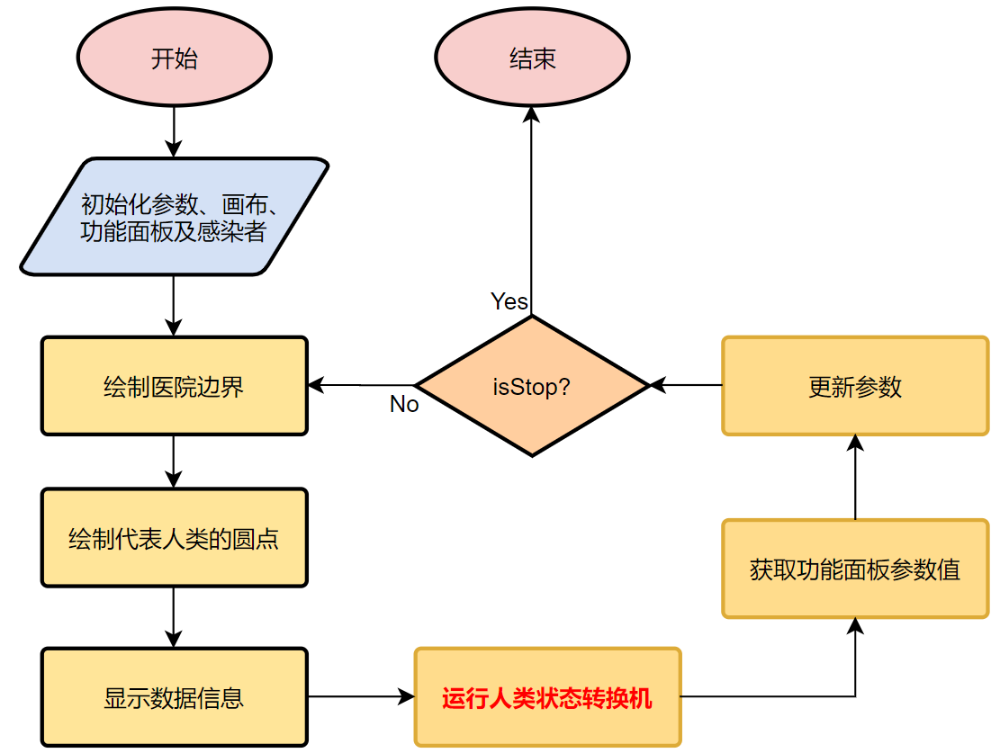
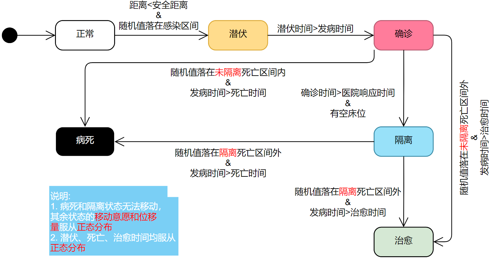
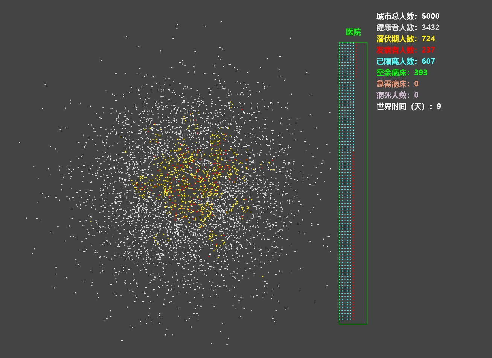
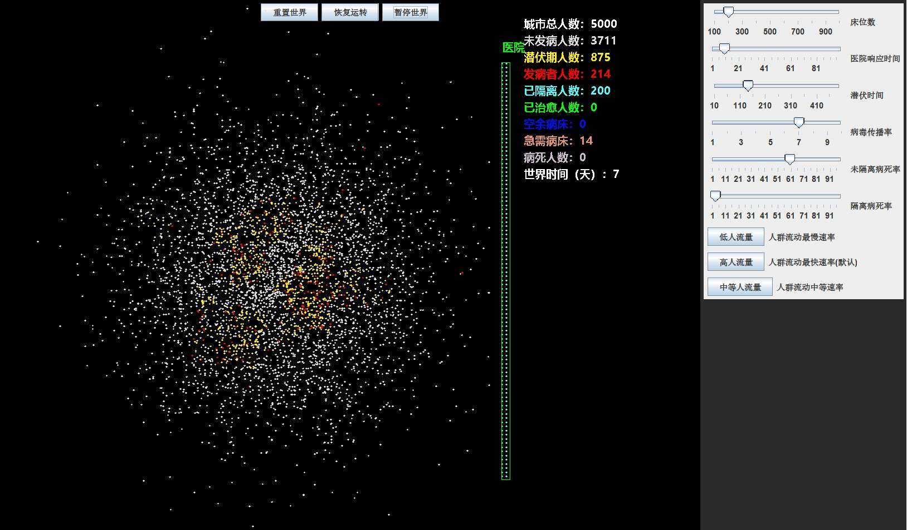
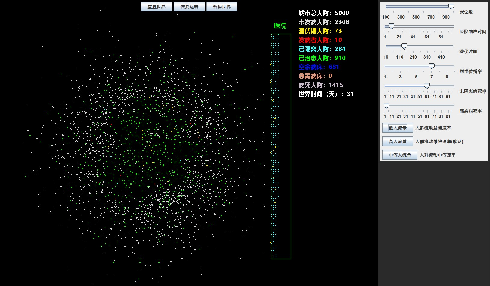

# Virus Simulation
Project for postgraduate recommendation of MNS
# Inspired By
[KikiLetGo/VirusBroadcast](https://github.com/KikiLetGo/VirusBroadcast), thanks for your contrib.
# Program Design
## Flow Chart

## State Machine of Person

# My work
* Implement an interaction interface
    * Dynamically adjust the Number of bed/Broad rate/
    Respond time/Shadow time/Mortality/Crowd mobility
    * Able to restart/pause/unpause the world
* Add cured person model
    * Cured time satisfies Gaussian distribution
    * Cured people have more immunity against virus
* Modify state machine
    * Assign different fatality value for freeze/confirmed person
# Demo
* KikiLetGo version

* My version

# TODO
* Introduce mathematical model, such as SEIR model
* Add curves to panel
* Save/Load state
